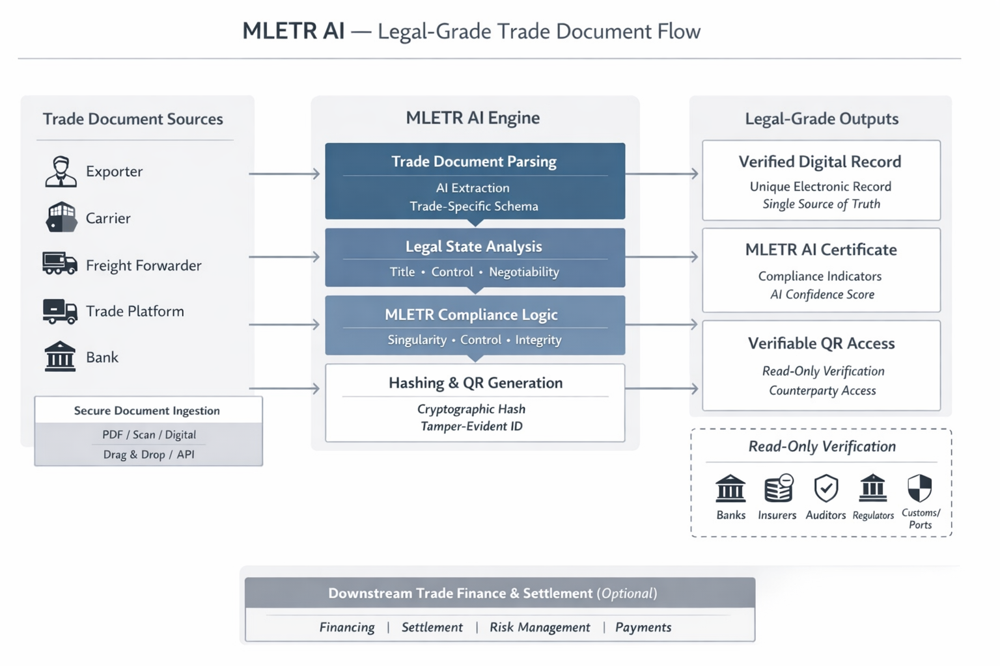

# MLETR AI

MLETR AI turns trade documents into **legally enforceable, verifiable digital records** — compliant by default with the UNCITRAL Model Law on Electronic Transferable Records (MLETR).

This is not generic document AI.\
This is **trade-native, law-aware infrastructure**.

***

### What MLETR AI Does

MLETR AI processes trade documents and outputs a **trusted digital record\*** that satisfies MLETR + ETDA requirements for:

* **Singul Source**
* **Verifiable Data**
* **Transference**
* **Compliance**

In minutes, not weeks.

\*meaning the underlying asset/value is verified.

<figure><figcaption></figcaption></figure>

***

### Supported Trade Documents (no limited to)

* Bills of Exchange
* Prom Notes
* Commercial Invoices
* Bills of Lading (BL / eBL)
* Packing Lists
* Title Docs
* Warehouse Receipts
* Trade Certificates
* Other transferable trade records

***

### How It Works

1. **Upload**
   * PDF, scan, or native digital document
2. **AI Parsing**
   * Trade-specific data extraction
   * Entity, value, shipment, and counterparty recognition
3. **MLETR Compliance Check**
   * Singularity validation
   * Control logic assessment
   * Integrity verification
4. **Hash + QR Generation**
   * Cryptographic hash
   * Verifiable QR code
   * Tamper-evident record
5. **MLETR AI Certificate**
   * Machine-readable
   * Human-readable
   * Regulator-ready

***

### MLETR AI Certificate

Every processed document includes an **MLETR AI Certificate**, containing:

* Document hash
* QR verification link
* Parsed data snapshot
* MLETR compliance indicators
* AI confidence score
* Timestamp and jurisdictional reference

This certificate can be shared with:

* Banks
* Auditors
* Insurers
* Regulators
* Trade counterparties

***

### Why MLETR AI Is Different

| Generic Document AI   | MLETR AI                    |
| --------------------- | --------------------------- |
| OCR + Data extraction | Legal-grade interpretation  |
| Document digitisation | Enforceable digital records |
| No legal context      | MLETR-aware by design       |
| Data output           | Trust output                |

If it’s not MLETR-aware, it’s **not trade-grade**.

***

### Built for Regulated Markets

MLETR AI is designed for environments where **legal certainty matters**:

* Trade finance
* Banking & custody
* Ports & customs
* Insurance & audit
* Government trade systems
* Portfolio clients audits

Read-only verification ensures trust without custody transfer.

***

### Deployment Options

* Web interface (drag & drop)
* API access for platforms
* Private or enterprise deployment
* Sandbox and regulator pilots

***

### Commercial Model

* Per-document pricing
* Volume-based API access
* Enterprise licensing

No long integrations required.\
Fast time to value.

***

### Strategic Role

MLETR AI is the **document trust layer** for modern trade infrastructure.

It standardises:

* Data
* Legal enforceability
* Verification

And unlocks:

* Faster settlement
* Reduced re-checks
* Lower operational risk
* Future-ready capital flows

***

### Status

* Production-ready
* Actively deployed
* Designed to scale across jurisdictions adopting MLETR

***

### About

MLETR AI is developed by **Paperless Labs**, a digital trade infrastructure company focused on making global trade faster, safer, and legally interoperable.

***

### Get Started

* Request access
* Run a pilot
* Integrate via API or our simple user Ai deal desk

**Turn trade documents into legally enforceable digital records — instantly at scale.**
